# primitive-survival
<h2>Primitive Survival mod for Vintage Story</h2>

https://www.vintagestory.at/

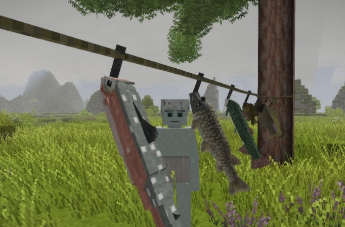

<h2>NOTE: THIS DOCUMENTATION HAS BEEN UPDATED FOR THE NEW RELEASE (WHICH ISN'T HERE...YET)</h2>

<h3>Download and Installation</h3>

Available via [GitHub Releases][DL].

To install: 
 - Run the game.
 - Choose <i>Mod Manager</i> in the main menu.
 - Click the <i>Open Mod Folder</i> button to open file explorer.
 - Copy the `.zip` file you downloaded here (don't extract it).

[DL]: https://github.com/spearandfang/primitive-survival/releases

<h3>Introduction</h3>

Here's the thing:  I'm a huge fan of Vintage Story and especially its <i>Wilderness Survival</i> mode.  I also have a keen interest in real life primitive survival. This mod is my attempt to to meld the two to provide you with a more realistic early game experience.  It also adds some new things to keep you busy at any point during the game.

<h3>Basics</h3>

The handbook now contains relatively complete instructions for this mod.  Look under <b>Guides - Primitive Survival: Quick Start Guide</b>.

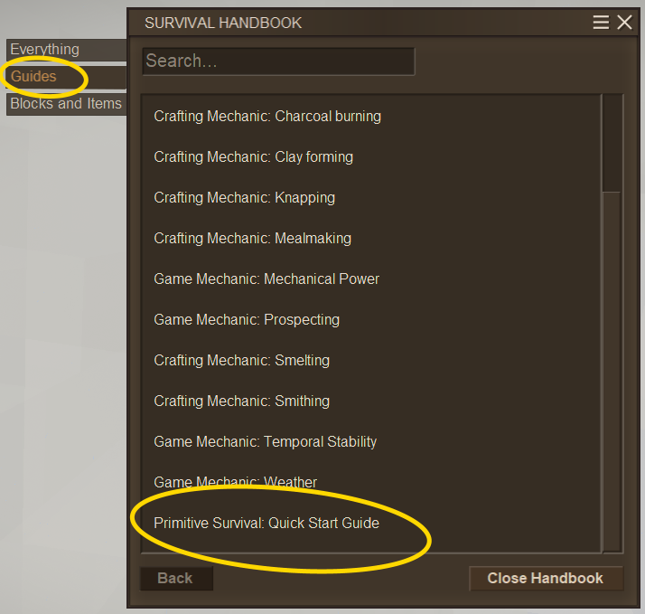

A couple of items that are essential for this mod are <b>stakes</b> (used to build weir traps and snares) and <b>cordage</b> (used to make limb lines, trotlines, fish baskets, and snares).  Stakes also make a good fence to protect you early on (think "boma").

<h4>Stake <i>(Shapeless)</i></h4>
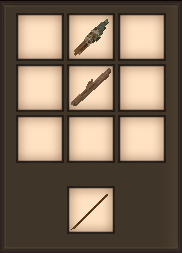
A knife (one of various types), and a stick 

<h4>Cordage <i>(Shapeless)</i></h4>
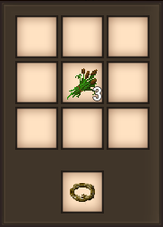
Three cattails or wildvine tips, or two wild vines 

<h3>Traps</h3>

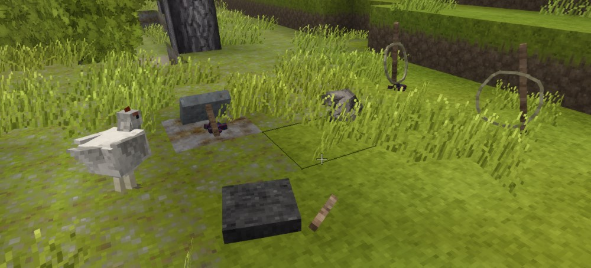

There are two traps - the <b>Deadfall</b> and the <b>Snare</b> - and they are very similar in nature.  They are designed to kill small animals on your behalf.  The only real difference is that the deadfall might kill a chicken or a hare (or a baby anything), while the snare might be able to take down bigger entities (like a fox or a boar) as well.  In both cases:

 - Larger entities (like a player or a wolf) will only take a bit of damage when coming into contact with one of these traps, and will trip it.  
 - Once a trap's been tripped, you can sneak - right click to set it again.
 - You can right click on any unbaited set trap to bait it (with a wide variety of food in hand).
 
<h4>Deadfall</h4>
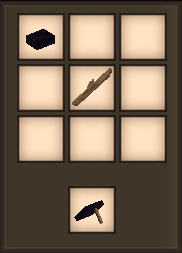
A stone (one of various types), and a stick 

<h4>Snare</h4>
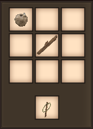
Cordage and a stake 

<h3>Fishing</h3>

There are currently four methods for fishing - a <b>Fish Basket</b>, a <b>Weir Trap</b>, a <b>Limb Line</b>, and <b>Trotline</b>.  They have some similarities but your mileage may vary when it comes to a preferred method.  For the most part:

 - A fish might simply steal your bait.
 - You can right click to remove fish.  Careful though, they're a little slippery!
 - You can right click on an unbaited hook or fish basket to re-bait it (with a wide variety of food in hand).  
 - Right click on a baited hook or fish basket to retrieve the bait.

The fish basket is pretty strightforward.  Place it in water but make sure there's free blocks of water all around it.  Now hurry up and wait...and maybe one or two fish will find their way into your basket.  

<h4>Fish Basket</h4>
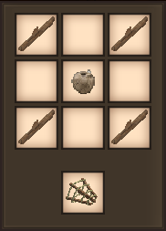
Twine and four sticks 

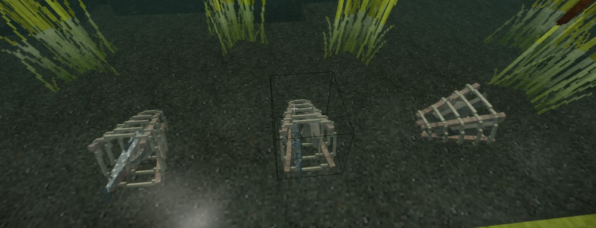

 
The weir trap is not so obvious.  You build a fenced in area with stakes, and then sneak-right click on the far side (center) of the fence to complete the trap.  Note: You cannot bait a weir trap.
  

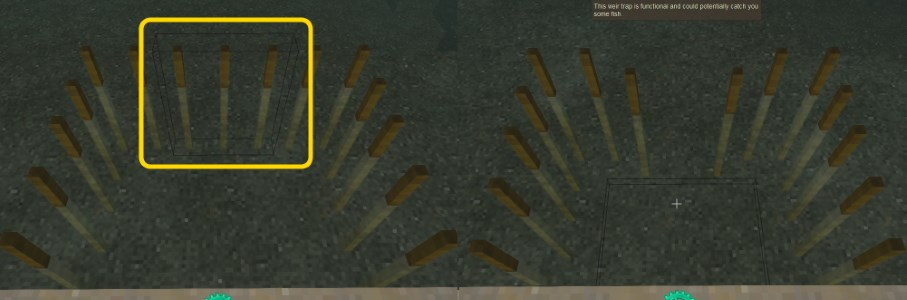

You might want to check on your fish basket or weir trap a little more frequently than something with a hook, since fish can escape quite easily.  Also note that the occasional sea shell or other trinket might drift into one of these two traps.

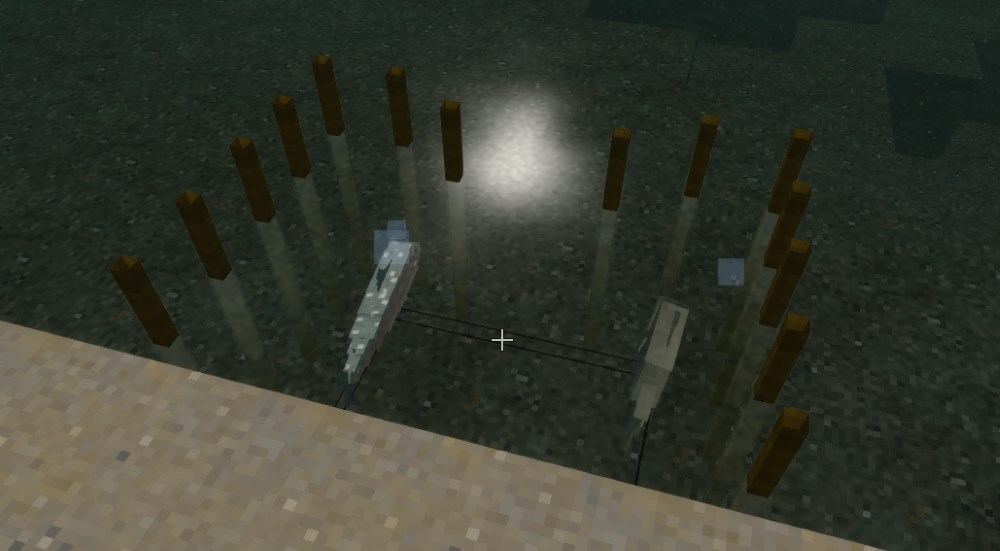

 

The trotline and limb line are a little more complicated because you're going to need <b>hooks</b>.  Hooks can be knapped with flint or one of several stones.

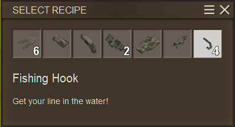

Face an object near water (i.e. a stake) with cordage in hand, and right click.  If you have enough cordage and there's a block to receive the far end of the cordage, you'll place a trotline.  Otherwise you'll place a limb line.  Once your line is in place you'll need to attach hooks (or baited hooks) to it by right clicking on a section of that line (with hook in hand).  Obviously if your hook isn't in water you won't catch a fish.

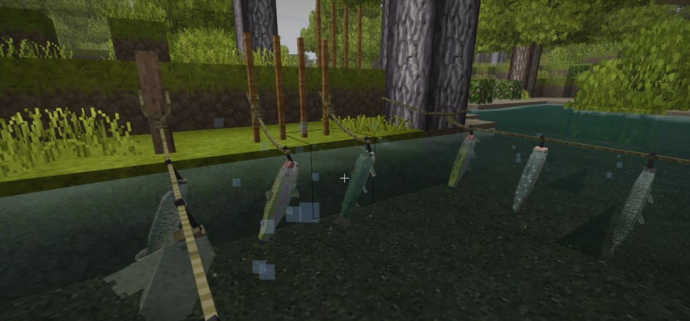

 

What do I do with all these raw fish?  Cook 'em up on a fire and eat 'em of course.  Note: The official Vintage Story Survival Bass had some issues with it's configuration, so I "borrowed" its json file/shape/texture, and reworked it as <b>Small Bass</b> (for lack of a better name). 

 
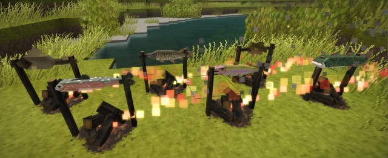
Dinner Time...
 

<h3>Jerky</h3>

The premise here is that you can "cure" meat to create <b>Jerky</b> by simply cutting it up into small strips and letting it dry in the sun.  So if you cut up your redmeat or bushmeat it will start to cure automatically.  Note: You can still cook it on a fire afterwards if you like (before it cures).

<h4>Jerky Redmeat (Raw) <i>(Shapeless)</i></h4>
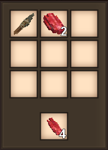
A knife and a piece of redmeat 

<h4>Jerky Bushmeat (Raw) <i>(Shapeless)</i></h4>
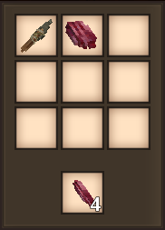
A knife and a piece of bushmeat 
 

<h3>Roadmap</h3>

Lot's more code refactoring, testing, and debugging required, and then it's on to:

 - Possibly animate the fish (get those tails moving anyways).  I mean the particles help, but...
 - Add one more primitive fishing option - a fishing rod.
 - Add additonal primitive traps, like figure four (or other) deadfalls, a pitch trap, etc. 
 - Vintage Story's Lovecraft inspired theme is also right up my alley as I have a real passion for pulp fiction, so I've already started to veer off in that direction.

 
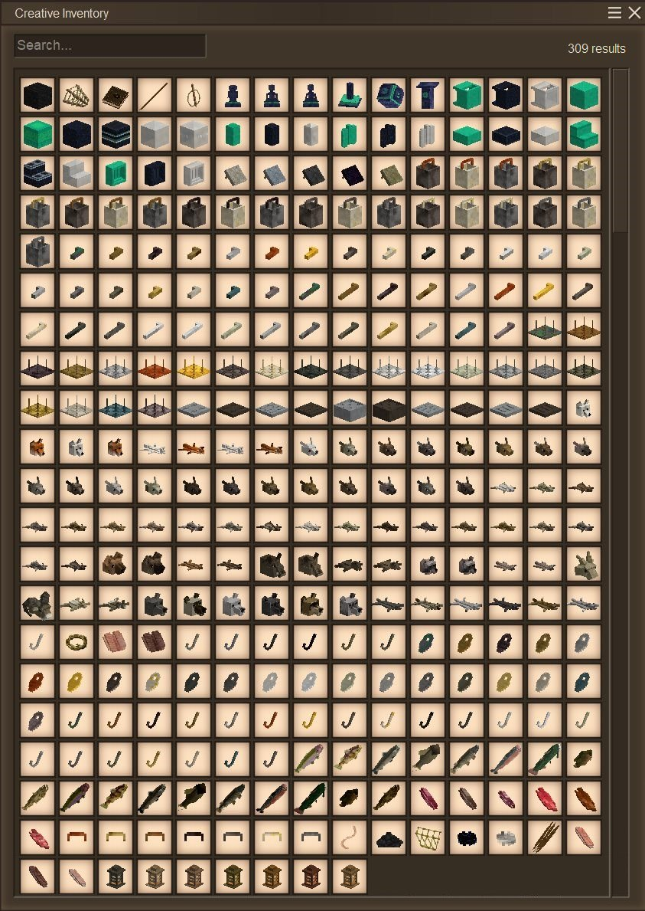
Creative Inventory for Primitive Survival...
 
