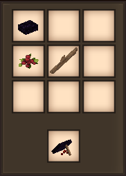
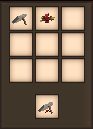
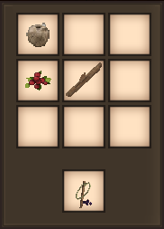
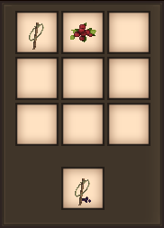
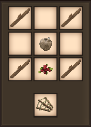
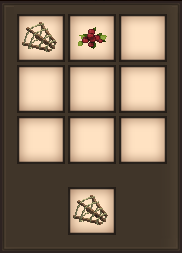
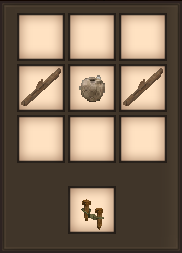
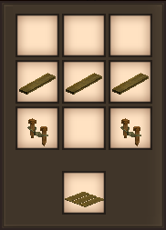

# primitive-survival
<h2>Primitive Survival Mod for Vintage Story</h2>

Here's the thing:  I'm a huge fan of Vintage Story and especially its <i>Wilderness Survival</i> mode.  I also have a keen interest in real life primitive survival. This mod is my attempt to to meld the two to provide you with a more realistic early game experience.  There's still a lot of testing and fine tuning on the docket so consider this a preview (perpetual beta might be a more accurate description).

<h3>Traps</h3>

There are two traps - the <b>Deadfall</b> and the <b>Snare</b> - and they are very similar in nature.  They are designed to kill small animals on your behalf.  The only real difference is that the deadfall might kill a chicken or a hare (or a baby anything), while the snare might be able to take down bigger entities (like a fox or a boar) as well.  In both cases:

 - Larger entities will take minimal damage when coming into contact with one of these traps, and trip it.  
 - Once a trap's been tripped, you'll need to break it and place it down to set it again.
 - You can right click on any unbaited set trap to bait it (with fruit in hand).
 
<h4>Deadfall (Set)</h4>

<h6>A stone (various types), and a stick</h6> 

<h4>Deadfall (Set and Baited)</h4>

<h6>A stone (various types), a stick, and any type of fruit</h6> 

<h4>Deadfall (Set and Baited) <i>Shapeless</i></h4>

<h6>A deadfall and any type of fruit</h6> 

<h4>Snare (Set)</h4>

<h6>Twine and a stick</h6> 

<h4>Snare (Set and Baited)</h4>

<h6>Twine, a stick, and any type of fruit</h6> 

<h4>Snare (Set and Baited) <i>Shapeless</i></h4>

<h6>A snare and any type of fruit</h6> 

<h3>Fishing</h3>

There are currently two methods for fishing - a <b>Fish Basket</b> and a <b>Trotline</b>.  They have some similarities but your mileage may vary when it comes to a preferred method.  In both cases:

 - A fish might simply steal your bait.
 - You can right click to remove fish.  Careful though, they're a little slippery!
 - You can right click on an unbaited hook or fish basket to re-bait it (with fruit in hand).

The fish basket is pretty strightforward.  Place it in water but make sure there's a free block of water in front of it.  Now hurry up and wait...and maybe one or two fish will find their way into your basket.  You might want to check on your fish basket a little more frequently than a trotline, since fish can escape quite easily.

<h4>Fish Basket</h4>

<h6>Twine and four sticks</h6> 

<h4>Fish Basket (Baited)</h4>

<h6>Twine, four sticks, and any type of fruit</h6> 

<h4>Fish Basket (Baited) <i>Shapeless</i></h4>

<h6>A fish basket and any type of fruit</h6> 

The trotline is a little more complicated because you're going to need <b>hooks</b>.  Hooks can be knapped with flint or one of several stones.

Place a trotline on a dirt block facing another dirt block of equal height.  Ideally there's some water between those two dirt blocks.  To place it successfully, you'll need as many trotlines as there are water blocks (between the two dirt blocks), and a clear line of sight.  Once your trotline is in place you'll need to attach hooks (or baited hooks) to it by right clicking on a section of trotline (with hook in hand).  Obviously if your hook isn't in water it's doubtful that you'll catch a fish.

<h4>Trotline</h4>

<h6>Twine and two sticks</h6> 

What do I do with all these raw fish?  Cook 'em up on a fire and eat 'em of course.  Note: The official Vintage Story Survival Bass had some issues with it's configuration, so I "borrowed" its json file/shape/texture, and reworked it as <b>Big Bass</b> (for lack of a better name).  I've also added a <b>Trout</b> for variety but it isn't pretty, because modelling (much like coding and documenting) is NOT my forte.

<h3>Jerky</h3>

The premise here is that you can "cure" meat to create <b>Jerky</b> by simply cutting it up into small strips and letting it dry in the sun.  So if you cut up your redmeat or bushmeat it will start to cure automatically.  Note: You can still cook it on a fire afterwards if you like (before it cures).

<h4>Jerky (Redmeat) Raw <i>Shapeless</i></h4>

<h6>A knife and a piece of redmeat</h6> 

<h4>Jerky (Bushmeat) Raw <i>Shapeless</i></h4>

<h6>A knife and a piece of bushmeat</h6> 

<h3>Rope Bridge</h3>

The <b>Rope Bridge</b> is a bit of an aside from primitive survival, and it's currently the only block that's suitable for Creative Building.  I added this block because it looks kinda cool and it wasn't much of a stretch after getting the trotline mostly fleshed out.

<h4>Rope bridge</h4>

<h6>Three boards (any type of wood) and two trotlines</h6> 

Place it just like you would a trotline - on an elevated dirt block facing another elevated dirt block.  To place it successfully, you'll need as many rope bridges as there are empty blocks between the two dirt blocks and a clear line of sight. Whether it's over water or high in the mountains, the rope bridge will get you to your destination quickly!

<h3>Roadmap</h3>

It's mostly going to be testing and tweaking for now, but I've got plans.  Big plans...

 - Familiarize myself with the whole server/client thing.
 - Get to the bottom of how to attract animals to the baited traps, much like the trough does.
 - Add more types of fish (and perhaps other random aquatic suprises).
 - Add additional primitive fishing options - a limb line, a funnel trap, and maybe even a primitive fishing rod.
 - Add additonal primitive traps, like figure four (or other) deadfalls, a pitch trap, etc. 
 - Vintage Story's Lovecraft inspired theme is also right up my alley as I have a real passion for pulp fiction, so I may just veer off in that direction.
